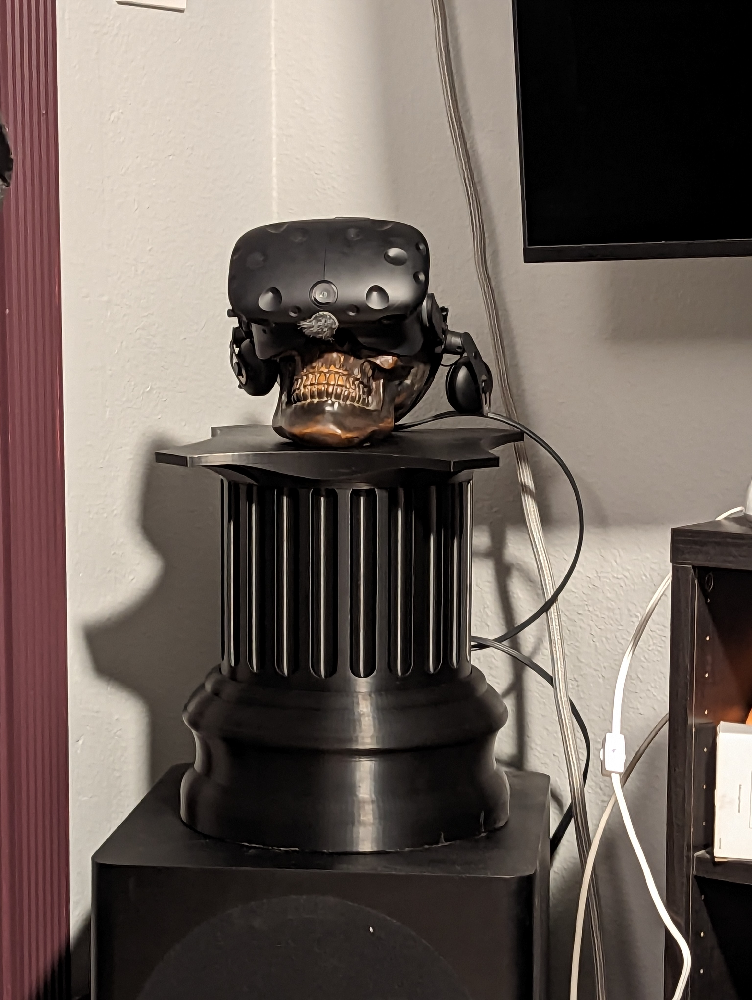

Description
-----------

A large column for holding my VR headset via a random skull I found at Ross. Its printed in 4 parts and designed for a 350x350 Voron - and won't fit on smaller without tweaking the design/printing in pieces.

Its also designed to simply stack vertically, optionally with gluing the lid base to the lid for greater rigidity. The base is hollow for filling with sand, to help keep the column from printing. Additionally the center column is empty, and could be used for storage (or running the cord inside if you wanted to put a hole in the back of the column)

If you wish to change the height of the column - just adjust the body piece in fusion360 - it will recalculate the flutes to still look nice.

Finally, on the backside of the lid, there are spots for M3 heat set inserts. This is to allow for flexability in designing cable management, if needed. Just use whatever anchor points you need, and design whatever you like to fit.

Additional Requirements
-----------------------

[M3 x D5.0 x L4.0 heat set inserts (optional)](https://www.aliexpress.us/item/3256802340684101.html)

Printing Considerations
-----------------------

Printed with a 0.6mm nozzle in ABS with gyroid infill at 0.2mm layer height. If you can print bigger, it'll probably safe you some time.

This is a huge print, and will not fit on less than a 350mmx350mm bed without additional work.

Credits
-------

[Gridfinity by Zack Freedman](https://gridfinity.xyz/)
[Gridfinity templates by KptnAutismus](https://github.com/KptnAutismus/KptnAutismus)

License
-------

CC-BY-NC-4.0 (See LICENSE.md )

