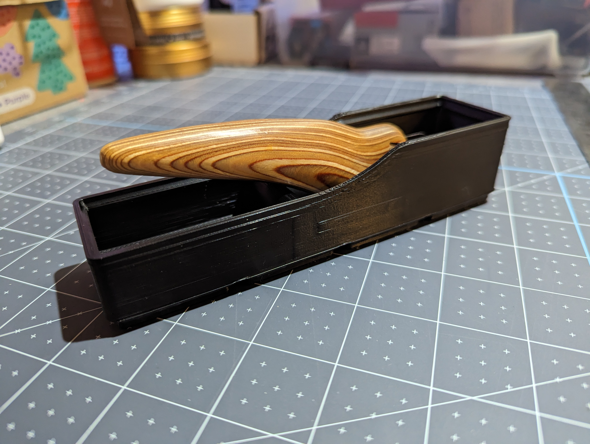

Description
-----------

A 1x4 gridfinity holder to store an ergo kiwi in a convinient to grab and set back angle

Additional Requirements
-----------------------

[Ergo Kiwi](https://ergokiwi.com/)

Printing Considerations
-----------------------

Printed with a 0.6mm nozzle in ABS with lightning infill.

No real need for that diameter or material, print however you're comfortable.

Credits
-------

[Gridfinity by Zack Freedman](https://gridfinity.xyz/)
[Gridfinity templates by KptnAutismus](https://github.com/KptnAutismus/KptnAutismus)

License
-------

CC-BY-NC-4.0 (See LICENSE.md )

