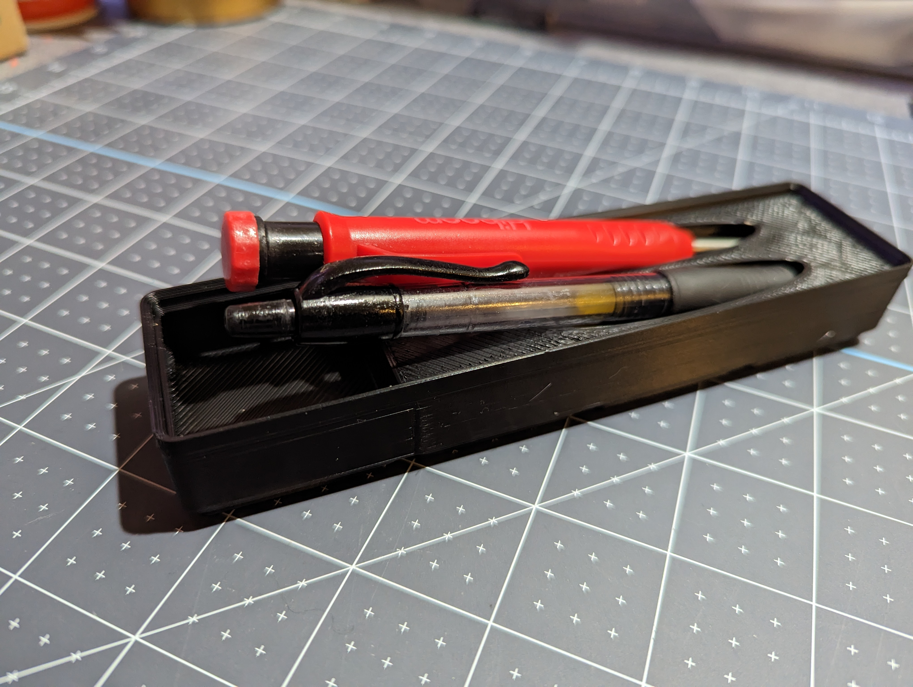

Description
-----------

A 1x4 gridfinity tray to hold an pen or pencil in a convinient position to grab and replace. Also designed to sit atop a 1x4 bin with replacement pens/pencils underneath. Please see the next section for the specific ones I designed around.  

Additional Requirements
-----------------------

Note: These are not referral links, just providing the thing that fits. Other pens/pencils may fit too, but ymmv.

Cerpenter Pencil [Amazon](https://www.amazon.com/dp/B09SB3DGPB) [Aliexpress](https://www.aliexpress.us/item/3256804687207617.html)

Bic Gelocity Pens [Amazon](https://www.amazon.com/dp/B000F2SRN0/)

Printing Considerations
-----------------------

Printed with a 0.6mm nozzle in ABS with lightning infill.

No real need for that diameter or material, print however you're comfortable.

Credits
-------

[Gridfinity by Zack Freedman](https://gridfinity.xyz/)
[Gridfinity templates by KptnAutismus](https://github.com/KptnAutismus/KptnAutismus)

License
-------

CC-BY-NC-4.0 (See LICENSE.md )

