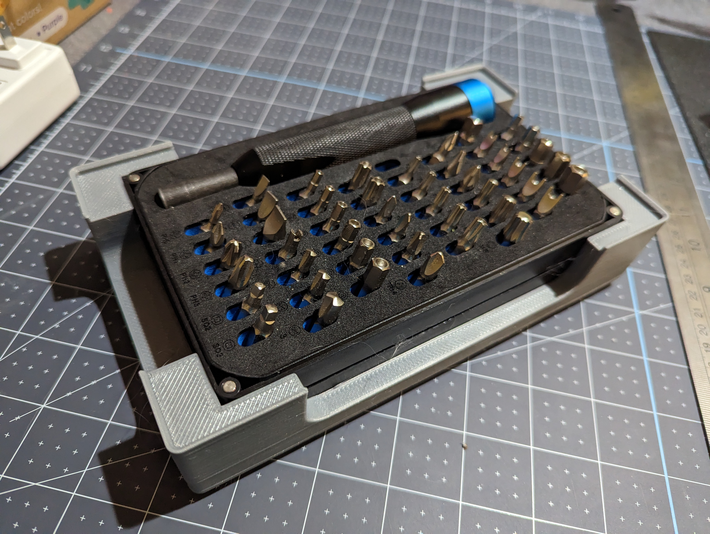

Description
-----------

A 3x5 gridfinity tray to hold an iFixit Mahi driver kit, open, with the lid on the bottom.  

Additional Requirements
-----------------------

[Mahi Driver Kit from iFixit](https://www.ifixit.com/products/mahi-driver-kit-48-bit-driver-kit)

Printing Considerations
-----------------------

Printed with a 0.6mm nozzle in ABS with lightning infill.

No real need for that diameter or material, print however you're comfortable.

Credits
-------

[Gridfinity by Zack Freedman](https://gridfinity.xyz/)
[Gridfinity templates by KptnAutismus](https://github.com/KptnAutismus/KptnAutismus)

License
-------

CC-BY-NC-4.0 (See LICENSE.md )

